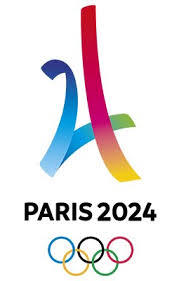

# Paris2024
[]()
[]()
[]()



This is a website for the Olympics game in Paris 2024. It is a school project based on Wordpress. We wanted to propose to the city of Paris, a website that combines both the highlighting of values that emanate from the organization of games, and the factual information that revolves around the event.

[See the demo](https://naimelayadi.com)


## How to 🎉

### Installation 📦 
First, do not forget to install [Node.js](https://nodejs.org/en/) and [Yarn](https://yarnpkg.com/en/docs/install). 
After downloaded the repository, install the node_modules in builder folder with : 

```
yarn install
```

### Running the app 🚀
To run the app, run this command in your terminal :
```
gulp
```
Then browser-sync should start and you should be able to see the app.


## Precisions 📝
- For the CSS, we added [CSSComb](https://github.com/csscomb/csscomb.js) to format and sort our code.
- We liked to use [gitmoji](https://github.com/carloscuesta/gitmoji/) when we commited to identify quickly the purpose of the commit 


## Other 🔎 

### Thanks 👥

To our fabulous designer [Adrien Laurent](https://www.behance.net/adrienlaur1f2a)

and the four other developers :
- [Kelly Phan](https://github.com/keellyp)
- [Bérénice David](https://github.com/BereniceDavid)
- [Johann Desobry](https://github.com/JohannDesobry)
- [Naim El Ayadi](https://github.com/naim-ea)

### Licence 📄
This repository is under MIT Licence.

